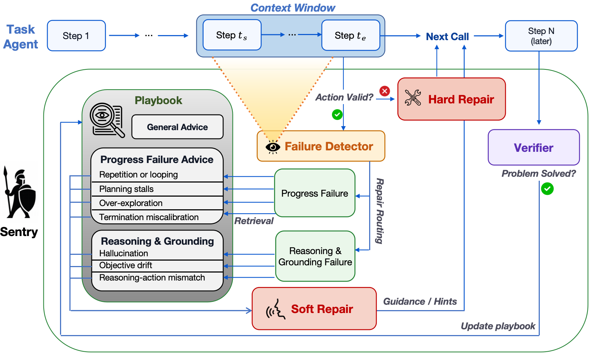

<p align="center">
  
</p>

# Sentry

### A Self-Evolving Failure Manager for Agentic LLM Systems

Sentry is an external, self-evolving runtime failure manager for LLM agents. It
monitors local execution trajectories, applies hard or soft recovery
interventions when failures arise, verifies whether these failures are fixed,
and stores successful rescues in an external playbook, separate from the task
agent's context.


The implementation lives in the `Sentry` Python package.

<p align="center">
  
</p>

## Core Ideas

Sentry monitors execution, repairs failures, verifies recovery, and stores
successful rescue insights in an external playbook.

**Monitoring and hard repair.** Sentry inspects a context window of the task
agent's recent trajectory and checks whether each proposed action is executable
under the required schema. Invalid actions trigger Hard Repair, which asks the
agent to rewrite the failed action into a valid one.

**Trajectory failures and soft repair.** If the proposed action is valid, Sentry
checks for local execution failures. Progress failures and reasoning/grounding
failures trigger Soft Repair, which retrieves matching playbook entries and
injects guidance for a better next step.

**Recovery verification and playbook update.** After each soft repair, Sentry
checks the next `H` reasoning-action-observation cycles to see whether the
failure was resolved. Successful rescues are summarized into trigger patterns
and repair principles, then added to the playbook.

## Main Results

Across four agentic benchmarks---WebShop, AppWorld, SWE-bench Lite, and  
Mind2Web---Sentry consistently improves task performance, outperforming static runtime-intervention baselines.


| Benchmark metric        | Base Agent | Sentry     |
| ----------------------- | ---------- | ---------- |
| WebShop avg. reward     | 0.1703     | **0.4677** |
| AppWorld avg. pass      | 25.59      | **38.53**  |
| SWE-bench Lite accuracy | 0.20       | **0.30**   |
| Mind2Web avg. reward    | 0.4200     | **0.7356** |


Sentry resolved **767 / 939** detected local failures overall (**81.7%**),
including **513 / 554** action-validity failures (**92.6%**). Ablations show
that hard repair, soft guidance, failure-specific retrieval, verified playbook
updates, and diagnosis-based intervention each contribute to performance.

Sentry uses **19.0M** total tokens across the evaluated benchmarks
(**1.54x** the base agent).

## Quick Start

```bash
python3 -m venv .venv
source .venv/bin/activate
pip install -r requirements.txt
python -m compileall -q Sentry
python - <<'PY'
from Sentry import Sentry, SentryConfig

sentry = Sentry(SentryConfig())
print(type(sentry).__name__)
PY
```

## Minimal API

```python
from Sentry import SentryRunner, agent_step_from_parts

runner = SentryRunner(model=my_judge_model)

for row in trajectory_rows:
    step = agent_step_from_parts(
        step_id=row["step_id"],
        reasoning=row.get("reasoning", ""),
        raw_action=row.get("action", ""),
        tool_name=row.get("tool_name"),
        tool_args=row.get("tool_args", {}),
        observation=row.get("observation", ""),
        parsed_ok=row.get("parsed_ok", True),
        schema_valid=row.get("schema_valid", True),
        task_progress_score=row.get("progress_score"),
        metadata=row.get("metadata", {}),
    )
    rescue = runner.step(step)
    if rescue is not None:
        agent.inject_observation(rescue.prompt_text)

runner.finalize(task_success=True)
```

## Package Layout

```text
Sentry/
  Sentry.py      main controller and runtime state machine
  integration.py convenience wrapper for model callbacks and dataset loops
  detector.py    failure detection and detector judge prompt parsing
  router.py      hard/soft/no-op routing and rescue prompt composition
  verifier.py    post-rescue escape verification
  playbook.py    retrieval, insight storage, update, and learning
  taxonomy.py    failure types and retrieval labels
  models.py      dataclasses plus trace/window construction helpers
  config.py      thresholds, logging, playbook, and judge config
  logging.py     JSONL event logging helpers
```

